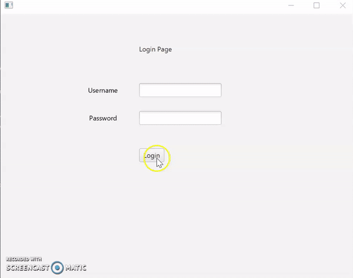

# Production Tracking System

This program tracks and produces audio and visual products. The products can be added to the line of products available to be made. Then from the product line, individual products can be chosen to be produced in mass quantities. During mass production, each product is also given a serial number. The program also has an add an employee account page.  
This program was made individually by Jose Silvestre-Bautista. 
I made this program when at an intermediate level of programming. 
I made this program for a school assignment. 
I made this program at Florida Gulf Coast University during the start of my second year.   

## Demonstration

 

## Documentation

To view coding documentation please see the link below.

[JavaDoc](https://josesilvestrebautista.github.io/ProductionTrackingSystem/)

## Diagrams

Such as a class diagram.   
The markdown is  \!\[Alt text\]\(relative/path/to/img.png)  
 

## Getting Started

Download an Idea such as Intellij. Make sure you have the Java 8 sdk and Java 8 jre.
Download the zip file version of the repository. Unzip and open through Intellij.

## Built With

Sof

## Contributing

This section is more important for real projects but is good to include in school projects.  
One of the main purposes of GitHub and similar services is to provide a means for project collaboration.  
Tell someone how they can contribute to this project.

## Author

* Your name

## License

Public repositories on GitHub are often used to share open source software. For your repository to truly be open source, you'll need to license it so that others are free to use, change, and distribute the software. https://help.github.com/articles/licensing-a-repository/  
You have the option to choose a license when you first create your repository.  
If you need to create a license for an existing repository...
1. Go to your repository.
2. Click on "Create new file" Button.
3. Type the file name as License.txt or License.md in the input box next to your repository name, a drop down button appears towards right side.
4. Choose the type of license of your choice.
5. Click "Commit new file" button at the bottom (Green button)
Credit https://stackoverflow.com/questions/31639059/how-to-add-license-to-an-existing-github-project  
To choose a license, see https://choosealicense.com/ 

## Acknowledgments

* Web sites utilized
* Classmates who helped
* Your professor or TA if they helped

## History

Information about what has changed. 

## Key Programming Concepts Utilized

This section would not necessarily be in a real README.   
It is a reference for you and a place to impress potential employers with your knowledge. 
Identify what concepts you utilize so when you need to use them again you will know that you will find them here. Include a brief description of the concepts in your own words to help you prepare for related interview questions. 
